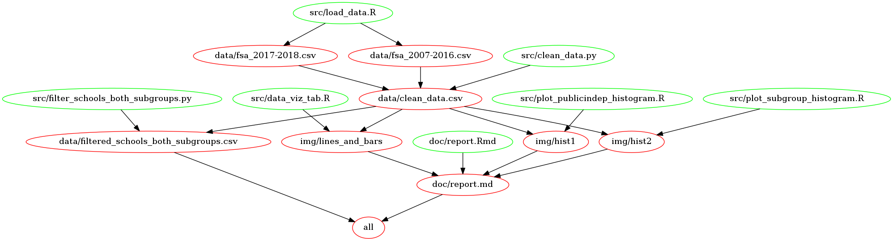

```{r setup, include=FALSE}
knitr::opts_chunk$set(echo = TRUE)
```

# Are There Differences in FSA Scores Between Subgroups?

Authors: (DSCI 522 Group 304) Anny Chih, Robert Pimentel, & Wenjiao Zou


Using [@FSA1] [here](https://catalogue.data.gov.bc.ca/dataset/bc-schools-foundation-skills-assessment-fsa-/resource/bcb547f0-8ba7-451f-9e11-10524f4d57a0) and [@FSA2] [here](https://catalogue.data.gov.bc.ca/dataset/bc-schools-foundation-skills-assessment-fsa-/resource/97c6cbf7-f529-464a-b771-9719855b86f6) from school years 2007/2008 through 2018/2019, we looked at whether there are differences in exam performance between different subgroups and school types to answer two main inferential questions:

1. Is there a difference in how well BC Public School vs Independent School students perform on the Numeracy and Reading sections of the FSA exam?  
2. Is there a difference in how well Aboriginal vs Non Aboriginal students perform on the Numeracy and Reading sections of the FSA exam?

By conducting hypothesis testing using t-test statistics and a 95% confidence interval, we determined that:  

1. Yes, there is a difference in how well BC Public School vs Independent School students perform on the Numeracy and Reading portions of the FSA exam; Independent School student scores are higher than Public School student scores.
2. Yes, there a difference in how well Aboriginal vs Non Aboriginal students perform on the Numeracy and Reading portions of the FSA exam; Non Aboriginal student scores are higher than Aboriginal student scores

The dataset used in this project includes two data files that contain FSA scores from BC students in Grades 4 and 7. Only data for the Numeracy and Reading portions of the FSA exam were analyzed (i.e. excludes Writing score analysis; see [report](https://github.com/UBC-MDS/DSCI_522_Group304/blob/master/doc/report.md) for additional details).

**Links to Preview Data Source:**  
- [@Definitions1] [link](https://catalogue.data.gov.bc.ca/dataset/bc-schools-foundation-skills-assessment-fsa-/resource/bcb547f0-8ba7-451f-9e11-10524f4d57a0)  
- [@Definitions2] [link](https://catalogue.data.gov.bc.ca/dataset/bc-schools-foundation-skills-assessment-fsa-/resource/97c6cbf7-f529-464a-b771-9719855b86f6)

## Report

The final report can be found [here](https://github.com/UBC-MDS/DSCI_522_Group304/blob/master/doc/report.md)

## Usage
To replicate this analysis, you can choose one of the four options listed below.   
For a visual map of how each file is connected, please see the Makefile Dependency Diagram below.

**Option 1: Using Terminal**

1. Clone/Download this GitHub repository  
2. Install the dependencies listed below  
3. Navigate to the root directory of this project in terminal  
4. Run the following commands at the command line/terminal

```
# Loads Data
Rscript src/load_data.R 'https://catalogue.data.gov.bc.ca/dataset/5554165d-e365-422f-bf85-4f6e4c9167dc/resource/bcb547f0-8ba7-451f-9e11-10524f4d57a0/download/foundation-skills-assessment-2017-18_to_2018-19.csv' --arg2='data/fsa_2017-2018.csv'
Rscript src/load_data.R 'https://catalogue.data.gov.bc.ca/dataset/5554165d-e365-422f-bf85-4f6e4c9167dc/resource/97c6cbf7-f529-464a-b771-9719855b86f6/download/fsa.csv' --arg2='data/fsa_2007-2016.csv'

# Cleans Data
python src/clean_data.py --raw_data1='data/fsa_2007-2016.csv' --raw_data2='data/fsa_2017-2018.csv' --local_path='data/clean_data.csv'

# Creates Data Subset of only schools with both Aboriginal and Non Aboriginal students (based on data in 2018/2019 school year)
python src/filter_schools_both_subgroups.py --clean_data='data/clean_data.csv' --new_data='data/filtered_schools_both_subgroups.csv'

# Appends a column to the clean_data file with info about whether the school has both Aboriginal and Non Aboriginal students
python src/add_subgroup_info.py --clean_data="data/clean_data.csv" --new_data="data/new_clean_data.csv"

# Produces EDA Bar and Line Charts
Rscript src/data_viz_tab.R --data='data/clean_data.csv' --out_dir='img'

# Produces Histograms for Inferential Question 1: Difference Between Public and Independent School Scores
Rscript src/plot_publicindep_histogram.R 'data/clean_data.csv' --arg2='img/' --arg3='fig_pi_histogram_numeracy.png' --arg4='fig_pi_histogram_reading.png' --arg5='fig_pi_histogram_writing.png'

# Produces Histograms for Inferential Question 2: Difference Between Aboriginal and Non Aboriginal Scores
Rscript src/plot_subgroup_histogram.R 'data/clean_data.csv' --arg2='img/' --arg3='fig_ana_histogram_numeracy.png' --arg4='fig_ana_histogram_reading.png' --arg5='fig_ana_histogram_writing.png'

# Renders Report
Rscript -e "rmarkdown::render('doc/report.Rmd')"
```

**Option 2: Using Makefile**  

1. Clone/Download this GitHub repository  
2. Install the dependencies listed below  
3. Navigate to the root directory of this project in terminal  
4. Run `make clean` at the command line/terminal  
5. Run `make all` at the command line/terminal  

**Option 3: Using Shell Script**  

1. Clone/Download this GitHub repository  
2. Install the dependencies listed below  
3. Navigate to the root directory of this project in terminal  
4. Run `bash runall.sh` at the command line/terminal

**Option 4: Using Docker**  

1. Install [Docker](https://www.docker.com/get-started)  
2. Clone/Download this GitHub repository    
3. Navigate to the root directory of this project in terminal   
4. Run `docker run --rm -v /$(pwd):/home/rstudio/DSCI_522_Group304 annychih/dsci522_group304_docker make -C /home/rstudio/DSCI_522_Group304 clean` at the command line/terminal
5. Run `docker run --rm -v /$(pwd):/home/rstudio/DSCI_522_Group304 annychih/dsci522_group304_docker make -C /home/rstudio/DSCI_522_Group304 all` at the command line/terminal

## Makefile Dependency Diagram



## Dependencies

* Python 3.6.9 and Python packages:
  - docoptpython >= 0.6.2
  - pandas >= 0.25.3
  
* R version 3.6.1 and R packages:
  - knitr >= 1.27.2
  - tidyverse >= 1.2.1
  - docopt >= 0.6.1
  - dplyr >= 0.8.3
  - readr >= 1.3.1
  - infer >= 0.5.0
  - repr >= 1.0.1
  - kableExtra >= 1.1.0
  - testthat >= 2.3.1
  - cowplot >= 1.0.0
  - broom >= 0.5.2

* GNU make 3.81

* Docker version 19.03.5

* pandoc version >= 2.9.1.1

# References