Are There Differences in FSA Scores Between Subgroups?
================
DSCI 522 Group 304: Anny Chih, Robert Pimentel, & Wenjiao Zou  
2020-01-23 (updated: 2020-01-25)

  - [Summary](#summary)
  - [Introduction](#introduction)
  - [Methods](#methods)
      - [Data](#data)
      - [Analysis](#analysis)
  - [Results](#results)
      - [Conclusion](#conclusion)
      - [Notes](#notes)
      - [References](#references)

# Summary

Using [BC Schools Foundational Skills Assessment
(FSA)](https://catalogue.data.gov.bc.ca/dataset/bc-schools-foundation-skills-assessment-fsa-)
scores from school years 2007/2008 through 2018/2019, we looked at
whether there are differences in exam performance between different
subgroups and school types to answer two main inferential questions:

1.  Is there a difference in how well BC Public School vs Independent
    School students perform on the FSA exam?  
2.  Is there a difference in how well Aboriginal vs Non Aboriginal
    students perform on the FSA exam?

By conducting hypothesis testing using t-test statistics and a 95%
confidence interval, we determined that:

1.  Yes, there is a difference in how well BC Public School vs
    Independent School students perform on the Numeracy and Reading
    portions of the FSA exam; Independent School student scores are
    higher than Public School student scores.
2.  Yes, there a difference in how well Aboriginal vs Non Aboriginal
    students perform on the Numeracy and Reading portions of the FSA
    exam; Non Aboriginal student scores are higher than Aboriginal
    student scores

# Introduction

Each year, the [BC Ministry of
Education](https://catalogue.data.gov.bc.ca/organization/ministry-of-education)
administers Foundational Skills Assessment (FSA) exams to all Grade 4
and 7 students in the province. The exams are split into three sections
to provide parents, teachers, schools, and other organizations with
information on how well students are performing in the areas of
Numeracy, Reading, and Writing.

By analyzing the differences in FSA scores between different school
types (Public / Independent) and subgroups (Aboriginal / Non Aboriginal)
using this publicly available dataset, we aim to highlight potential
discrepancies in the quality of education that young students receive
within the province.

We believe it’s important for every child in BC to receive a quality
education regardless of whether they attend public or independent
(private) schools. We also believe that by highlighting differences in
the performance of different subgroups on these tests, readers may
consider the possibility that additional programs to reduce these
differences are needed.

# Methods

## Data

The data used in this project was provided by [BC Ministry of
Education](https://catalogue.data.gov.bc.ca/organization/ministry-of-education)
- [Education
Analytics](https://catalogue.data.gov.bc.ca/organization/education-analytics)
and is licenced under an [Open Government Licence - British
Columbia](https://www2.gov.bc.ca/gov/content/data/open-data/open-government-licence-bc).

This project uses two data files that contain FSA scores from BC
students in Grades 4 and 7. The data in the two files have some
differences in score summary columns (see FSA field definitions for more
info), so only the common fields from these data files are included in
this project’s analysis. Rows with summary scores on provincial and
district levels have been removed so that only school-level information
remains. One row of erroneous data was also removed.

The score shown on each row of data represents the average score of all
students who wrote the specified exam (Numeracy / Reading / Writing),
within the noted school and subgroup. Since the Writing portion of the
exam was scored out of 12 from 2007/08-2016/17 but was changed to be
scored out of 4 (only one question) in 2017, we have removed it from
this analysis and focus only on scores within the Numeracy and Reading
portions of the FSA exam.

**Links to Preview Data:**  
\- [Foundation Skills
Assessment 2017/18-2018/19](https://catalogue.data.gov.bc.ca/dataset/bc-schools-foundation-skills-assessment-fsa-/resource/bcb547f0-8ba7-451f-9e11-10524f4d57a0)  
\- [Foundation Skills
Assessment 2007/08-2016/17](https://catalogue.data.gov.bc.ca/dataset/bc-schools-foundation-skills-assessment-fsa-/resource/97c6cbf7-f529-464a-b771-9719855b86f6)

**Links to Preview Data Field Definitions:**  
\- [FSA Field
Definitions 2017/18-2018/19](https://catalogue.data.gov.bc.ca/dataset/bc-schools-foundation-skills-assessment-fsa-/resource/ccc5ae0c-922a-4c11-ad44-908d6ec8a873)  
\- [FSA Field
Definitions 2007/08-2016/17](https://catalogue.data.gov.bc.ca/dataset/bc-schools-foundation-skills-assessment-fsa-/resource/5f6d7594-5645-4cda-980b-87195d1c1c16)

## Analysis

The R and Python programming languages (R Core Team 2019; Van Rossum and
Drake 2009) and the following R and Python packages were used in this
project: - tidyverse (Wickham 2017) - knitr (Xie 2014) - docopt (de
Jonge 2018) - docoptpython (Keleshev 2014) - dplyr (Wickham et al. 2019)
- repr (Angerer, Kluyver, and Schulz 2019) - pandas (Safia Abdalla 2019)
- readr (Wickham, Hester, and Francois 2018) - infer (Bray et al. 2019)

T-tests were carried out to test the null hypothesis that there are no
differences in the means of the aggregate FSA scores between students of
different subgroups, as shown in this report. Additional code used to
develop this report can be found here:
<https://github.com/UBC-MDS/DSCI_522_Group304>

# Results

**Question 1: Is there a difference in how well BC Public School vs
Independent School students perform on the FSA exam?**

**EDA**  
During the exploratory data analysis portion of this project, we found
that across most subgroups the mean aggregate FSA scores for students in
independent schools were higher than the scores for students in public
schools, and this difference was seen across all years.

The bar plots below show scores across all subgroups for students from
BC Independent Schools and BC Public Schools for Numeracy and Reading
sections of the exam. The line graphs below show the scores for all
students across time (2007/2008 - 2018/2019 school years) for the same
exam sections. BC Independent School scores are represented in red, and
BC Public School scores are represented in blue.

*Note:* The graphs below have been shrunken to fit within the width of
this report and may be difficult to read. The purpose of including these
graphs is simply to illustrate that mean aggregate scores for BC
Independent School students were generally higher than mean aggregate
scores for BC Public School students across all subgroups and time
periods. To view larger versions of the graphs, please see the ‘img’
folder of this project repository.

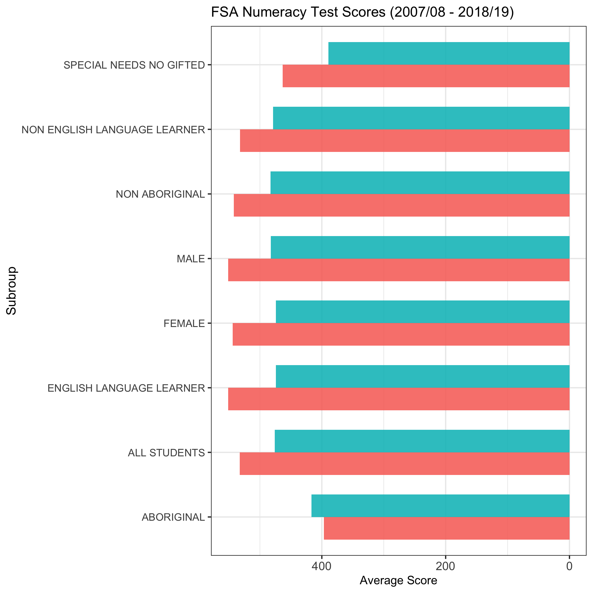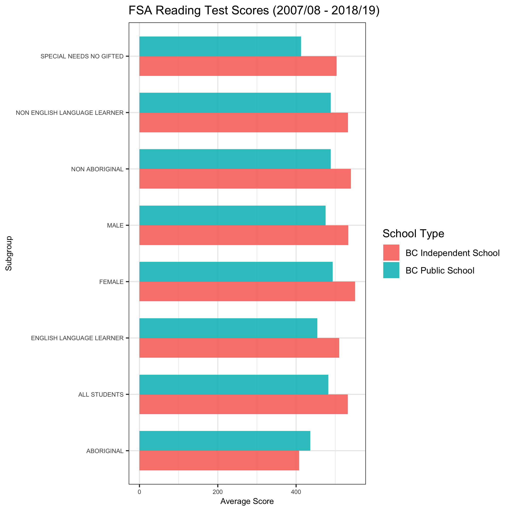

Fig: Mean aggregate scores by across subgroups (Red: BC Independent
Schools, Blue: BC Public Schools)

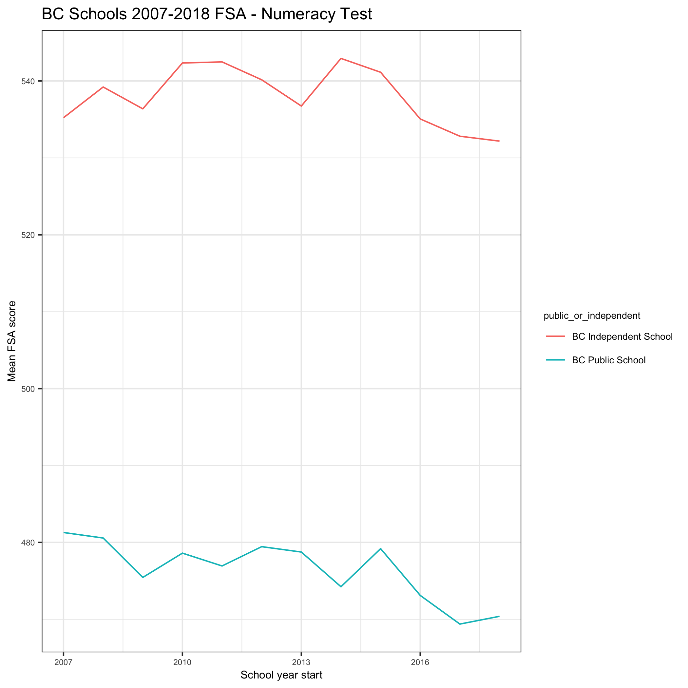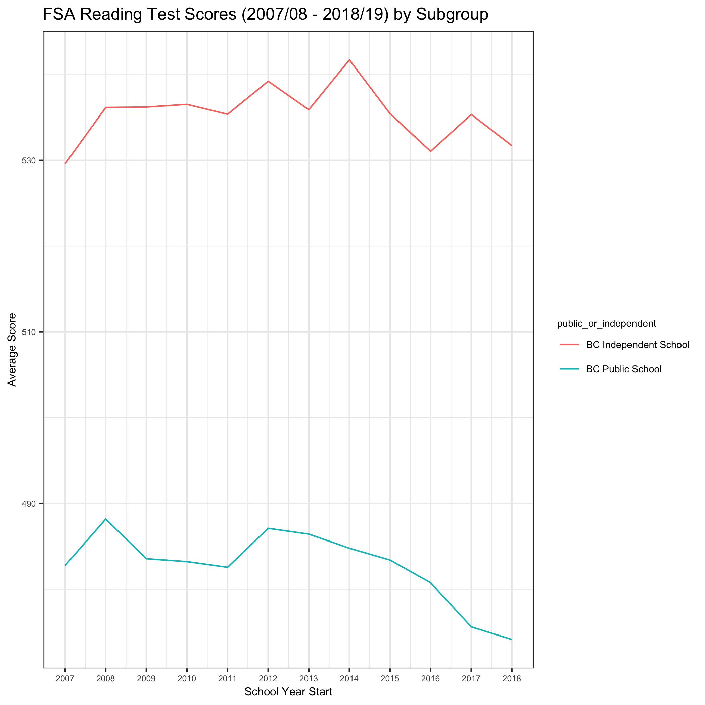

Fig: Mean aggregate scores by across subgroups (Red: BC Independent
Schools, Blue: BC Public Schools)

**ANALYSIS**  
To determine if the differences in mean aggregate FSA scores seen above
are significant, we first visualized the scores using boxplots and
histograms to plot the mean aggregate scores for each exam section.

The following plots visualize the difference in scores using boxplots.
The boxplots for the mean aggregate scores between the subgroups does
not overlap much for both Numeracy and Reading sections of the exam,
which suggests that the difference in scores may be significant.

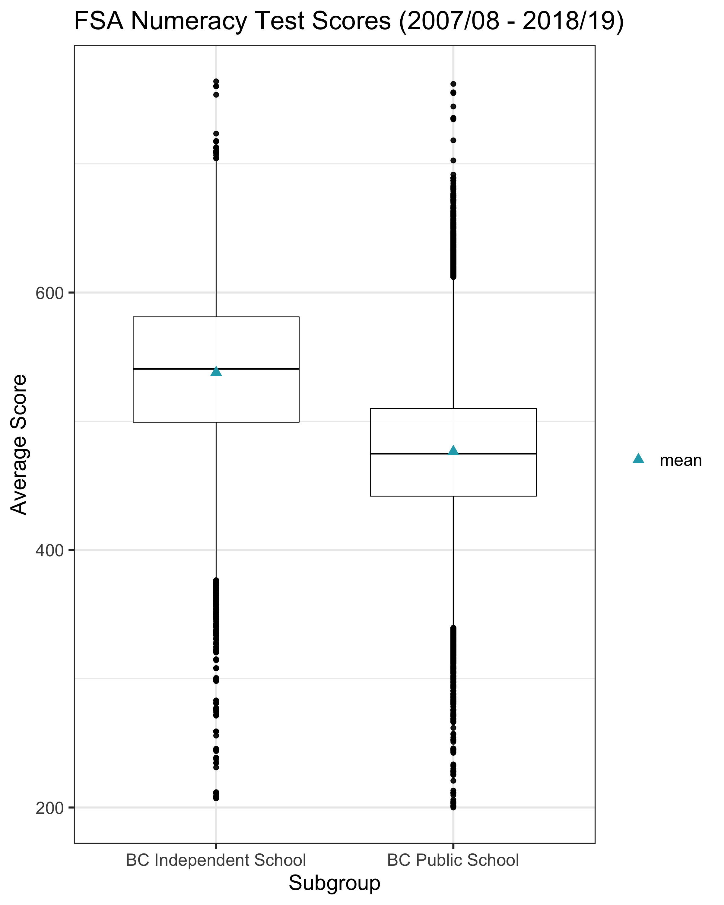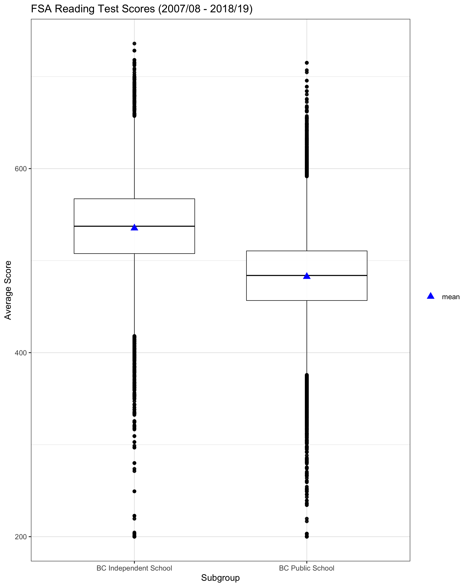

Fig: Boxplots of mean aggregate scores for Numeracy and Reading sections
of the FSA exam by school type (BC Independent School / BC Public
School)

Data from both groups was filtered accordingly to observe the
distribution of aggregate scores using histograms (bin size = 50). In
addition, 95% confidence intervals of the mean aggregate scores were
estimated by bootstrapping the aggregate scores for all students, for
both groups, using a random sample (size = 50) and resampling with
replacement 5000 times.

Noticed that because the confidence intervals (difference between dash
lines of same color) for both groups and skills do not overlap, we
should expect a significant difference in mean aggregate scores for both
skills between groups when we run a T-test statistics.

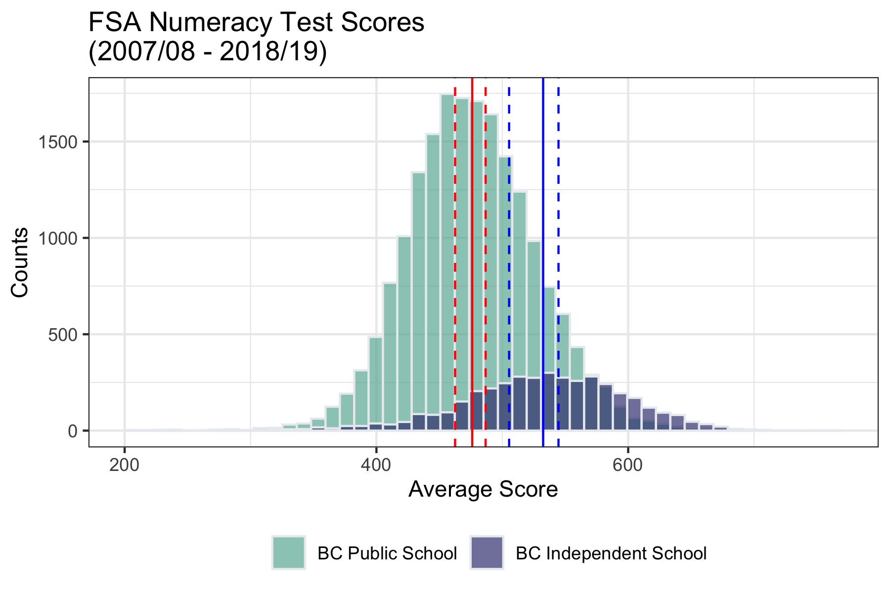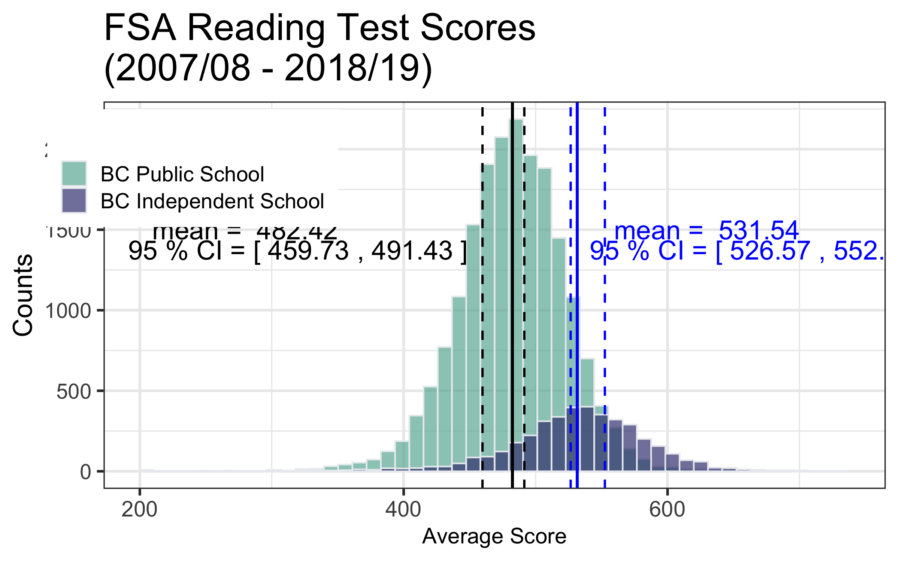

Fig: Histograms showing distributions of mean aggregate scores for
Numeracy and Reading section of the FSA exam by school type (BC
Independent School / BC Public School)

After visualizing the differences, we conducted t-tests at a 95%
confidence interval to confirm that the differences are actually
significant at this level, and find that they are:

T-test for Differences in Numeracy Scores Between BC Independent School
Students and BC Public School Students:

    ## 
    ##  Welch Two Sample t-test
    ## 
    ## data:  score by public_or_independent
    ## t = 118.01, df = 21472, p-value < 2.2e-16
    ## alternative hypothesis: true difference in means is not equal to 0
    ## 95 percent confidence interval:
    ##  60.42374 62.46486
    ## sample estimates:
    ## mean in group BC Independent School      mean in group BC Public School 
    ##                            537.8528                            476.4085

T-test for Differences in Reading Scores Between BC Independent School
Students and BC Public School Students:

    ## 
    ##  Welch Two Sample t-test
    ## 
    ## data:  score by public_or_independent
    ## t = 123.39, df = 21554, p-value < 2.2e-16
    ## alternative hypothesis: true difference in means is not equal to 0
    ## 95 percent confidence interval:
    ##  51.85891 53.53303
    ## sample estimates:
    ## mean in group BC Independent School      mean in group BC Public School 
    ##                            535.2799                            482.5839

**Question 2: Is there a difference in how well Aboriginal vs Non
Aboriginal students perform on the FSA exam?**

**EDA**

During the exploratory data analysis portion of this project, we found
that scores for Aboriginal students were generally lower than scores for
Non Aboriginal students in both Numeracy and Reading sections of the FSA
exam. The bar plots below show this difference, and the line plots below
show that the scores are consistently lower for Aboriginal students over
time.

Fig: Mean aggregate scores by subgroup (Aboriginal / Non Aboriginal)

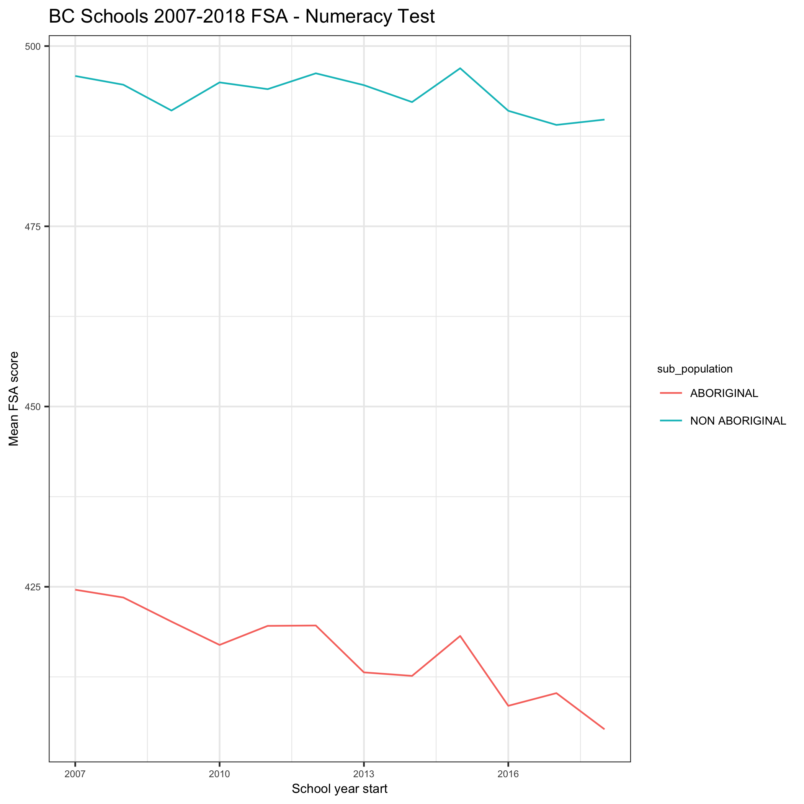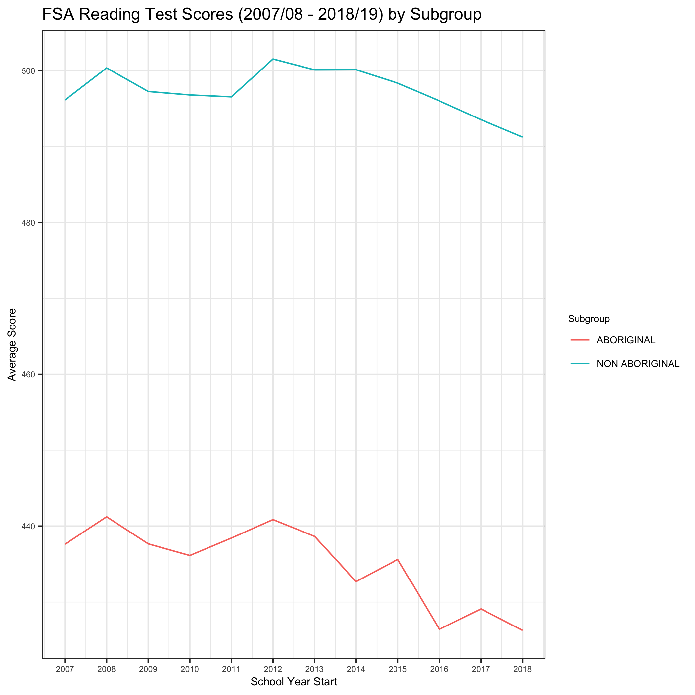

Fig: Mean aggregate scores of subgroups (Aboriginal / Non Aboriginal)
over time

**ANALYSIS**  
To determine if the differences in mean aggregate FSA scores seen above
are significant, we again visualized the scores using boxplots and
histograms to plot the mean aggregate scores for each exam section.

The following plots visualize the difference in scores using boxplots.
Here we see that the boxplots for the different subgroups (Aboriginal /
Non Aboriginal) do not overlap, which is a strong indicator that there
is a significant difference in scores between the groups.

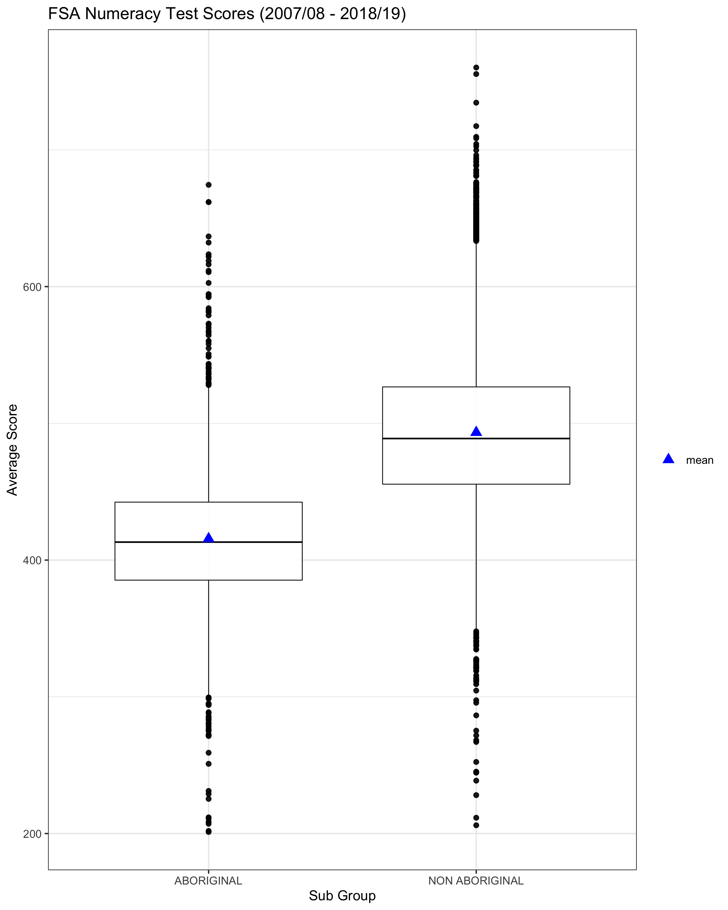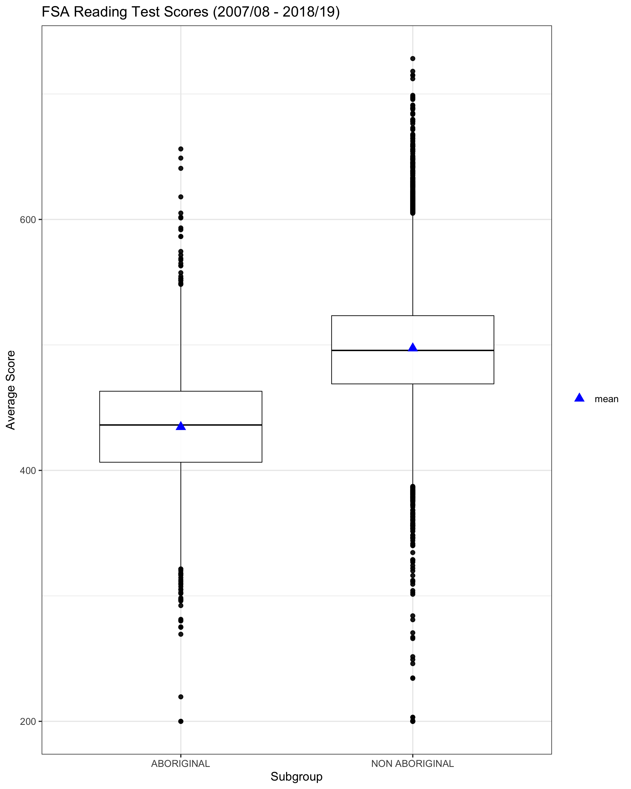

Fig: Boxplots of mean aggregate scores for Numeracy and Reading sections
of the FSA exam by subgroup (Aboriginal / Non Aboriginal)

Histograms and confidence intervals for both FSA skills and groups
(aboriginal vs non-aboriginal) were constructed in the same way as with
the independent vs public shools for consistency purposes. Results on
the plots also indicate that there is a significant difference in scores
between the two student’s subgroups for both numeracy and reading
skills.

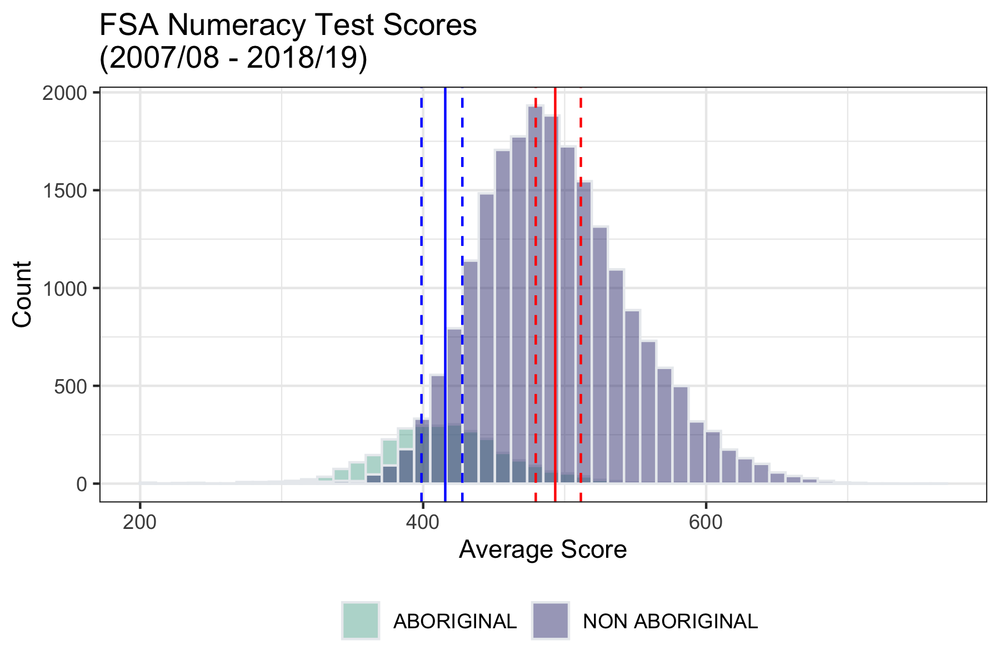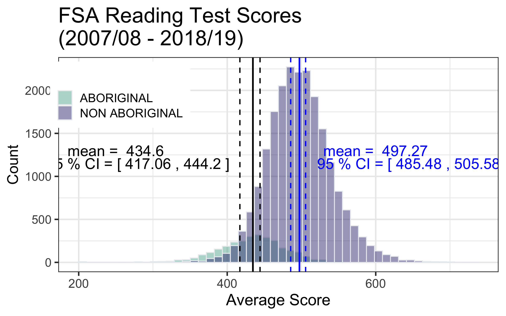

Fig: Histograms showing distributions of mean aggregate scores for
Numeracy and Reading section of the FSA exam by subgroup (Aboriginal /
Non Aboriginal)

After visualizing the differences, we conducted t-tests at a 95%
confidence interval to confirm that the differences are actually
significant at this level, and find that they are:

T-test for Differences in Numeracy Scores Between Aboriginal and Non
Aboriginal Students:

    ## 
    ##  Welch Two Sample t-test
    ## 
    ## data:  score by sub_population
    ## t = -78.617, df = 3946.4, p-value < 2.2e-16
    ## alternative hypothesis: true difference in means is not equal to 0
    ## 95 percent confidence interval:
    ##  -79.65955 -75.78311
    ## sample estimates:
    ##     mean in group ABORIGINAL mean in group NON ABORIGINAL 
    ##                     415.6077                     493.3290

T-test for Differences in Reading Scores Between Aboriginal and Non
Aboriginal Students:

    ## 
    ##  Welch Two Sample t-test
    ## 
    ## data:  score by sub_population
    ## t = -69.341, df = 3728.3, p-value < 2.2e-16
    ## alternative hypothesis: true difference in means is not equal to 0
    ## 95 percent confidence interval:
    ##  -64.45038 -60.90596
    ## sample estimates:
    ##     mean in group ABORIGINAL mean in group NON ABORIGINAL 
    ##                     434.5958                     497.2740

## Conclusion

The graphs and statistical tests above confirm that there are
significant differences in mean aggregate FSA exam scores between
students from BC Independent Schools and BC Public Schools, and between
Aboriginal and Non Aboriginal students, in Numeracy and Reading portions
of the exam. The next question we’d like *you* to answer is what we can
do about this.

## Notes

As with all inferential analyses such as this one, it’s possible that
there are confounding variables that have not been accounted for in this
project. Such variables may include the funding each school receives,
the level of affluence of a school’s district, whether the neighborhood
offers programs to improve numeracy and reading skills, and so on. In an
effort to combat this issue, we did also run t-tests using subsets of
the data to confirm that there are significant differences in scores for
Aboriginal and Non Aboriginal students even in subsets of the data that
include only schools with both subgroups of students.

To determine if schools met the criteria of having both Aboriginal and
Non Aboriginal students, the data was filtered to include only schools
who had both Aboriginal and Non Aboriginal Grade 4 students who wrote
the exam in the 2018/2019 school year. For more details, please see the
`src/filter_schools_both_subgroups.py` script.

The following t-test confirms that there is a significant difference at
the 95% confidence interval between Numeracy scores of Aboriginal and
Non Aboriginal students:

    ## 
    ##  Welch Two Sample t-test
    ## 
    ## data:  score by sub_population
    ## t = -24.481, df = 2007.1, p-value < 2.2e-16
    ## alternative hypothesis: true difference in means is not equal to 0
    ## 95 percent confidence interval:
    ##  -45.84942 -39.04824
    ## sample estimates:
    ##     mean in group ABORIGINAL mean in group NON ABORIGINAL 
    ##                     420.6382                     463.0870

The following t-test confirms that there is a significant difference at
the 95% confidence interval between Reading scores of Aboriginal and Non
Aboriginal students:

    ## 
    ##  Welch Two Sample t-test
    ## 
    ## data:  score by sub_population
    ## t = -27.365, df = 1945.6, p-value < 2.2e-16
    ## alternative hypothesis: true difference in means is not equal to 0
    ## 95 percent confidence interval:
    ##  -45.82215 -39.69337
    ## sample estimates:
    ##     mean in group ABORIGINAL mean in group NON ABORIGINAL 
    ##                     436.9096                     479.6673

However, this isn’t to say that there are no differences between schools
with and without Aboriginal students. In fact, the following t-test
confirms that there is also a significant difference in Numeracy scores
(for all students) for schools with Aboriginal students and students
without Aboriginal students.

    ## 
    ##  Welch Two Sample t-test
    ## 
    ## data:  score by has_both
    ## t = 33.838, df = 2573.1, p-value < 2.2e-16
    ## alternative hypothesis: true difference in means is not equal to 0
    ## 95 percent confidence interval:
    ##  36.49086 40.98025
    ## sample estimates:
    ## mean in group 0 mean in group 1 
    ##        489.2179        450.4823

And this test confirms that there is also a significant difference in
Reading scores (for all students) for schools with Aboriginal students
and students without Aboriginal students.

    ## 
    ##  Welch Two Sample t-test
    ## 
    ## data:  score by has_both
    ## t = 25.592, df = 2495.7, p-value < 2.2e-16
    ## alternative hypothesis: true difference in means is not equal to 0
    ## 95 percent confidence interval:
    ##  23.84188 27.79870
    ## sample estimates:
    ## mean in group 0 mean in group 1 
    ##        493.1948        467.3746

What all these tests mean is that there may be other factors (ex. school
district affluence) that happen to be associated with whether a school
has Aboriginal students (ex. Aboriginal communities may be more likely
to live in areas with lower affluence) that contribute to whether a
school’s students perform well on the FSA exam. But, even if you look at
only schools with both Aboriginal and Non Aboriginal students, there is
still a significant difference in the scores between these two
subgroups. We chose not to filter the dataset used in the `Analysis`
section of this report to include only schools with both Aboriginal and
Non Aboriginal students so that we would have a larger dataset to sample
from when visualizing the differences.

## References

Angerer, Philipp, Thomas Kluyver, and Jan Schulz. 2019. *Repr:
Serializable Representations*.
<https://CRAN.R-project.org/package=repr>.

Bray, Andrew, Chester Ismay, Evgeni Chasnovski, Ben Baumer, and Mine
Cetinkaya-Rundel. 2019. *Infer: Tidy Statistical Inference*.
<https://CRAN.R-project.org/package=infer>.

de Jonge, Edwin. 2018. *Docopt: Command-Line Interface Specification
Language*. <https://CRAN.R-project.org/package=docopt>.

Keleshev, Vladimir. 2014. *Docopt: Command-Line Interface Description
Language*. <https://github.com/docopt/docopt>.

R Core Team. 2019. *R: A Language and Environment for Statistical
Computing*. Vienna, Austria: R Foundation for Statistical Computing.
<https://www.R-project.org/>.

Safia Abdalla, Joris Van den Bossche, Tom Augspurger. 2019. *Pandas:
Powerful Python Data Analysis Toolkit*.
<https://github.com/pandas-dev/pandas>.

Van Rossum, Guido, and Fred L. Drake. 2009. *Python 3 Reference Manual*.
Scotts Valley, CA: CreateSpace.

Wickham, Hadley. 2017. *Tidyverse: Easily Install and Load the
’Tidyverse’*. <https://CRAN.R-project.org/package=tidyverse>.

Wickham, Hadley, Romain François, Lionel Henry, and Kirill Müller. 2019.
*Dplyr: A Grammar of Data Manipulation*.
<https://CRAN.R-project.org/package=dplyr>.

Wickham, Hadley, Jim Hester, and Romain Francois. 2018. *Readr: Read
Rectangular Text Data*. <https://CRAN.R-project.org/package=readr>.

Xie, Yihui. 2014. “Knitr: A Comprehensive Tool for Reproducible Research
in R.” In *Implementing Reproducible Computational Research*, edited by
Victoria Stodden, Friedrich Leisch, and Roger D. Peng. Chapman;
Hall/CRC. <http://www.crcpress.com/product/isbn/9781466561595>.

