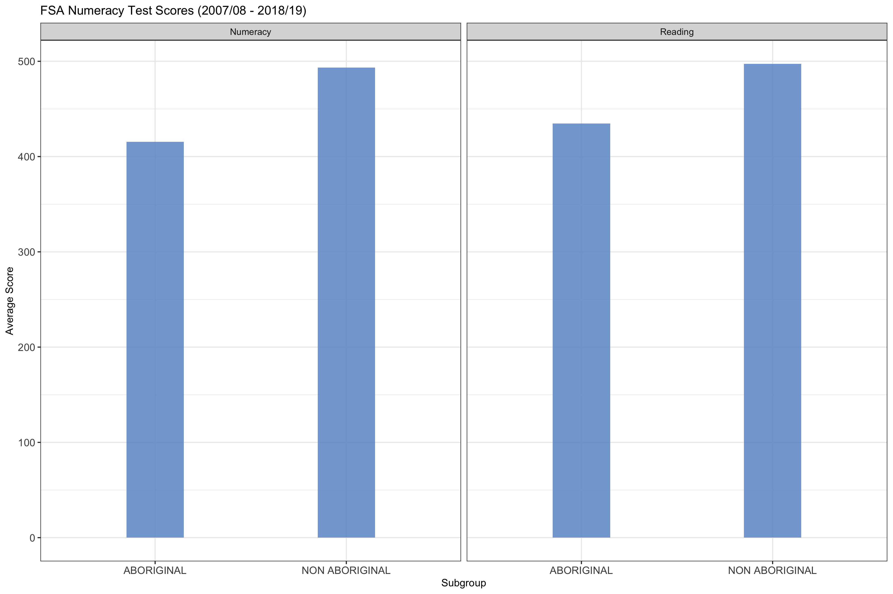
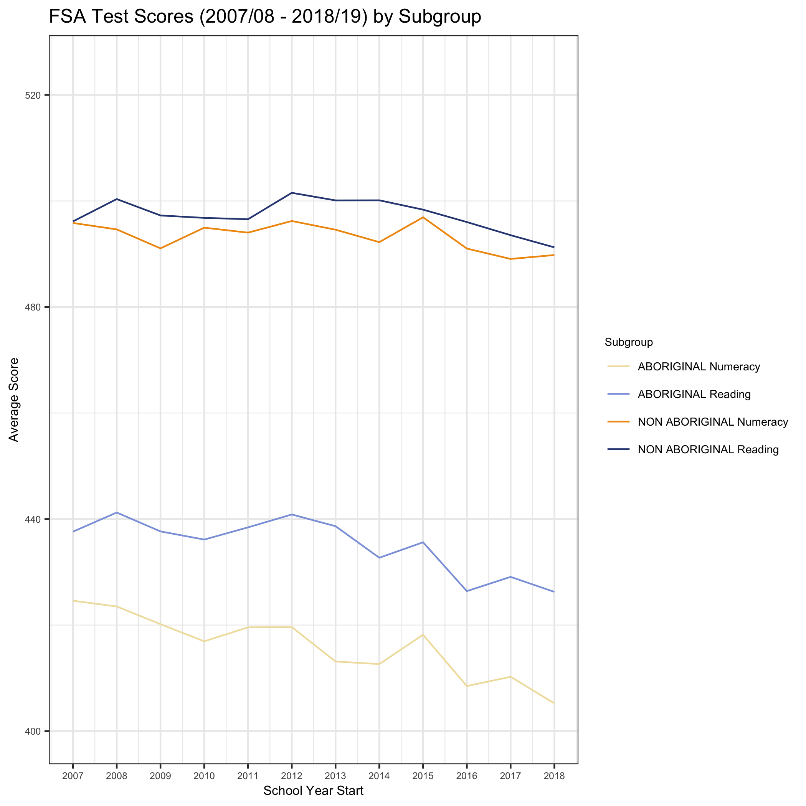

Are There Differences in FSA Scores Between Subgroups?
================
DSCI 522 Group 304: Anny Chih, Robert Pimentel, & Wenjiao Zou  
2020-01-23 (updated: 2020-02-05)

# Summary

Using [BC Schools Foundational Skills Assessment
(FSA)](https://catalogue.data.gov.bc.ca/dataset/bc-schools-foundation-skills-assessment-fsa-)
scores from school years 2007/2008 through 2018/2019, we looked at
whether there are differences in exam performance between different
subgroups and school types to answer two main inferential questions:

1.  Is there a difference in how well BC Public School vs Independent
    School students perform on the Numeracy and Reading sections of the
    FSA exam?
    
      - *Null Hypothesis*: There is no difference in how well BC Public
        School and Independent School students perform on the Numeracy
        and Reading sections of the FSA exam.  
      - *Alternative Hypothesis*: There is a difference in how well BC
        Public School and Independent School students perform on the
        Numeracy and Reading sections of the FSA exam.

2.  Is there a difference in how well Aboriginal vs Non Aboriginal
    students perform on the Numeracy and Reading sections of the FSA
    exam?
    
      - *Null Hypothesis*: There is no difference in how well Aboriginal
        and Non Aboriginal students perform on the Numeracy and Reading
        sections of the FSA exam.  
      - *Alternative Hypothesis*: There is a difference in how well
        Aboriginal and Non Aboriginal students perform on the Numeracy
        and Reading sections of the FSA exam.

By conducting hypothesis testing using t-test statistics and a 95%
confidence interval, we determined that:

1.  Yes, there is a difference in how well BC Public School vs
    Independent School students perform on the Numeracy and Reading
    portions of the FSA exam; Independent School student scores are
    higher than Public School student scores.
2.  Yes, there a difference in how well Aboriginal vs Non Aboriginal
    students perform on the Numeracy and Reading portions of the FSA
    exam; Non Aboriginal student scores are higher than Aboriginal
    student scores.

# Introduction

Each year, the [BC Ministry of
Education](https://catalogue.data.gov.bc.ca/organization/ministry-of-education)
administers Foundational Skills Assessment (FSA) exams to all Grade 4
and 7 students in the province. The exams are split into three sections
to provide parents, teachers, schools, and other organizations with
information on how well students are performing in the areas of
Numeracy, Reading, and Writing.

By analyzing the differences in FSA scores between different school
types (Public / Independent) and subgroups (Aboriginal / Non Aboriginal)
using this publicly available dataset, we aim to highlight potential
discrepancies in the quality of education that young students receive
within the province.

We believe it’s important for every child in BC to receive a quality
education regardless of whether they attend public or independent
(private) schools. We also believe that by highlighting differences in
the performance of different subgroups on these tests, readers may
consider the possibility that additional programs to reduce these
differences are needed.

# Methods

## Data

The data used in this project was provided by [BC Ministry of
Education](https://catalogue.data.gov.bc.ca/organization/ministry-of-education)-
[Education
Analytics](https://catalogue.data.gov.bc.ca/organization/education-analytics)
and is licenced under an [Open Government Licence - British
Columbia](https://www2.gov.bc.ca/gov/content/data/open-data/open-government-licence-bc).

This project uses two data files that contain FSA scores from BC
students in Grades 4 and 7. The data in the two files have some
differences in score summary columns (see FSA field definitions for more
info), so only the common fields from these data files are included in
this project’s analysis. Rows with summary scores on provincial and
district levels have been removed so that only school-level information
remains. One row of erroneous data was also removed.

The score shown on each row of data represents the average score of all
students who wrote the specified exam (Numeracy / Reading / Writing),
within the noted school and subgroup. Since the Writing portion of the
exam was scored out of 12 from 2007/08 - 2016/17 but was changed to be
scored out of 4 (only one question) in 2017/2018, we have removed it
from this analysis and focus only on scores within the Numeracy and
Reading portions of the FSA exam.

**Links to Preview Data:**  
\- [Foundation Skills
Assessment 2017/18-2018/19](https://catalogue.data.gov.bc.ca/dataset/bc-schools-foundation-skills-assessment-fsa-/resource/bcb547f0-8ba7-451f-9e11-10524f4d57a0)  
\- [Foundation Skills
Assessment 2007/08-2016/17](https://catalogue.data.gov.bc.ca/dataset/bc-schools-foundation-skills-assessment-fsa-/resource/97c6cbf7-f529-464a-b771-9719855b86f6)

**Links to Preview Data Field Definitions:**  
\- [FSA Field
Definitions 2017/18-2018/19](https://catalogue.data.gov.bc.ca/dataset/bc-schools-foundation-skills-assessment-fsa-/resource/ccc5ae0c-922a-4c11-ad44-908d6ec8a873)  
\- [FSA Field
Definitions 2007/08-2016/17](https://catalogue.data.gov.bc.ca/dataset/bc-schools-foundation-skills-assessment-fsa-/resource/5f6d7594-5645-4cda-980b-87195d1c1c16)

## Analysis

The R and Python programming languages (R Core Team 2019; Van Rossum and
Drake 2009) and the following R and Python packages were used in this
project:

  - tidyverse (Wickham 2017)

  - knitr (Xie 2014)

  - docopt (de Jonge 2018)

  - docoptpython (Keleshev 2014)

  - dplyr (Wickham et al. 2019)

  - repr (Angerer, Kluyver, and Schulz 2019)

  - pandas (Safia Abdalla 2019)

  - readr (Wickham, Hester, and Francois 2018)

  - infer (Bray et al. 2019)

  - broom (Robinson and Hayes 2020)

  - Makefile (Chemie.fu-berlin.de 2016)

  - kableExtra (Hao Zhu 2019)

  - testthat (Hadley Wickham 2019)

  - png
    (**???**)

  - grid
    (**???**)

  - gridExtra
    (**???**)

  - cowplot (Wilke 2019)

T-tests were carried out to test the null hypothesis that there are no
differences in the means of the aggregate FSA scores between students of
different subgroups, as shown in this report. Additional code used to
develop this report can be found here:
<https://github.com/UBC-MDS/DSCI_522_Group304>

# Results

**Question 1: Is there a difference in how well BC Public School vs
Independent School students perform on the FSA exam?**

**EDA**  
During the exploratory data analysis portion of this project, we found
that across most subgroups the mean aggregate FSA scores for students in
independent schools were higher than the scores for students in public
schools, and this difference was seen across all years.

The bar plots below show scores across all subgroups for students from
BC Independent Schools and BC Public Schools for Numeracy and Reading
sections of the exam. The line graphs below show the scores for all
students across time (2007/2008 - 2018/2019 school years) for the same
exam sections. BC Independent School scores are represented in red, and
BC Public School scores are represented in blue.

*Note:* The graphs below have been shrunken to fit within the width of
this report and may be difficult to read. The purpose of including these
graphs is simply to illustrate that mean aggregate scores for BC
Independent School students were generally higher than mean aggregate
scores for BC Public School students across all subgroups and time
periods. To view larger versions of the graphs, please see the
[img](https://github.com/UBC-MDS/DSCI_522_Group304/tree/master/img)
folder of the project repository.

**ANALYSIS**  
To determine if the differences in mean aggregate FSA scores seen above
are significant, we first visualized the scores using boxplots and
histograms to plot the mean aggregate scores for each exam section.

The following plots visualize the difference in scores using boxplots.
The boxplots for the mean aggregate scores between the subgroups do not
overlap much for both Numeracy and Reading sections of the exam, which
suggests that the differences in scores may be significant.

Data from both groups was filtered accordingly to observe the
distribution of aggregate scores using histograms (bin size = 50). In
addition, 95% confidence intervals of the mean aggregate scores were
estimated by bootstrapping the aggregate scores for all students, for
both groups, using a random sample (size = 50) and resampling with
replacement 5000 times.

Note that because the confidence intervals (areas between dash lines of
same color) for both groups do not overlap in either histogram, we can
expect a significant difference in mean aggregate scores for both skills
between groups when we apply T-tests.

After visualizing the differences, we conducted t-tests at a 95%
confidence interval to confirm that the differences are actually
significant at this level, and find that they are:

*T-test for Differences in Numeracy Scores Between BC Independent School
Students and BC Public School Students:*

<table class="table" style="margin-left: auto; margin-right: auto;">

<thead>

<tr>

<th style="text-align:right;">

Estimated Difference

</th>

<th style="text-align:right;">

P-value

</th>

<th style="text-align:right;">

Confidence Interval (Low)

</th>

<th style="text-align:right;">

Confidence Interval (High)

</th>

</tr>

</thead>

<tbody>

<tr>

<td style="text-align:right;">

61.4443

</td>

<td style="text-align:right;">

0

</td>

<td style="text-align:right;">

60.42374

</td>

<td style="text-align:right;">

62.46486

</td>

</tr>

</tbody>

</table>

*T-test for Differences in Reading Scores Between BC Independent School
Students and BC Public School Students:*

<table class="table" style="margin-left: auto; margin-right: auto;">

<thead>

<tr>

<th style="text-align:right;">

Estimated Difference

</th>

<th style="text-align:right;">

P-value

</th>

<th style="text-align:right;">

Confidence Interval (Low)

</th>

<th style="text-align:right;">

Confidence Interval (High)

</th>

</tr>

</thead>

<tbody>

<tr>

<td style="text-align:right;">

52.69597

</td>

<td style="text-align:right;">

0

</td>

<td style="text-align:right;">

51.85891

</td>

<td style="text-align:right;">

53.53303

</td>

</tr>

</tbody>

</table>

**Question 2: Is there a difference in how well Aboriginal vs Non
Aboriginal students perform on the FSA exam?**

**EDA**

During the exploratory data analysis portion of this project, we found
that scores for Aboriginal students were generally lower than scores for
Non Aboriginal students in both Numeracy and Reading sections of the FSA
exam. The bar plots below show this difference, and the line plots below
show that the scores are consistently lower for Aboriginal students over
time.

**ANALYSIS**  
To determine if the differences in mean aggregate FSA scores seen above
are significant, we again visualized the scores using boxplots and
histograms to plot the mean aggregate scores for each exam section.

The following plots visualize the difference in scores using boxplots.
Here we see that the boxplots for the different subgroups (Aboriginal /
Non Aboriginal) do not overlap, which is a strong indicator that there
is a significant difference in scores between the groups.

For consistency, histograms and confidence intervals for both skills
(Numeracy and Reading) and subgroups (aboriginal vs non-aboriginal) were
constructed in the same way here as with the independent vs public shool
analysis. Results on these plots also indicate that there is a
significant difference in scores between the two student subgroups for
both numeracy and reading skills.

After visualizing the differences, we conducted t-tests at a 95%
confidence interval to confirm that the differences are actually
significant at this level, and find that they are:

*T-test for Differences in Numeracy Scores Between Aboriginal and Non
Aboriginal Students:*

<table class="table" style="margin-left: auto; margin-right: auto;">

<thead>

<tr>

<th style="text-align:right;">

Estimated Difference

</th>

<th style="text-align:right;">

P-value

</th>

<th style="text-align:right;">

Confidence Interval (Low)

</th>

<th style="text-align:right;">

Confidence Interval (High)

</th>

</tr>

</thead>

<tbody>

<tr>

<td style="text-align:right;">

\-77.72133

</td>

<td style="text-align:right;">

0

</td>

<td style="text-align:right;">

\-79.65955

</td>

<td style="text-align:right;">

\-75.78311

</td>

</tr>

</tbody>

</table>

*T-test for Differences in Reading Scores Between Aboriginal and Non
Aboriginal Students:*

<table class="table" style="margin-left: auto; margin-right: auto;">

<thead>

<tr>

<th style="text-align:right;">

Estimated Difference

</th>

<th style="text-align:right;">

P-value

</th>

<th style="text-align:right;">

Confidence Interval (Low)

</th>

<th style="text-align:right;">

Confidence Interval (High)

</th>

</tr>

</thead>

<tbody>

<tr>

<td style="text-align:right;">

\-62.67817

</td>

<td style="text-align:right;">

0

</td>

<td style="text-align:right;">

\-64.45038

</td>

<td style="text-align:right;">

\-60.90596

</td>

</tr>

</tbody>

</table>

## Conclusion

The graphs and statistical tests above confirm that there are
significant differences in mean aggregate FSA exam scores between
students from BC Independent Schools and BC Public Schools, and between
Aboriginal and Non Aboriginal students, in Numeracy and Reading portions
of the exam. The next question we’d like *you* to answer is what we can
do about this.

## Future Direction

Following a peer review session with fellow Master of Data Science
candidates, we found that a natural next question to this analysis is
whether there are differences in subgroup performance within school
types. For example, there is an “urban legend” that girls perform better
in private schools than boys due to peer pressure. To test this myth, we
could investigate the differences in FSA scores between female and male
subgroups in only BC Independent Schools. We could then look at the
differences in FSA scores betwen the subgroups in only BC Public Schools
and see if there are significant differences in subgroup (Female / Male)
performance in both - or just one of the - school types (BC Independent
/ Public).

## Notes on Limitations

As with all inferential analyses such as this one, it’s possible that
there are confounding variables that have not been accounted for in this
project. Such variables may include the funding each school receives,
the level of affluence of a school’s district, whether the neighborhood
offers programs to improve numeracy and reading skills, and so on. In an
effort to combat this issue, we ran additional t-tests to confirm that
there are significant differences in scores for Aboriginal and Non
Aboriginal students even in subsets of the data that include only
schools with both subgroups of students.

To determine if schools met the criteria of having both Aboriginal and
Non Aboriginal students, the data was filtered to include only schools
who had both Aboriginal and Non Aboriginal Grade 4 students who wrote
the exam in the 2018/2019 school year. For more details, please see the
`src/filter_schools_both_subgroups.py` script.

The following t-test confirms that there is a significant difference at
the 95% confidence interval between Numeracy scores of Aboriginal and
Non Aboriginal students using this school data subset:

<table class="table" style="margin-left: auto; margin-right: auto;">

<thead>

<tr>

<th style="text-align:right;">

Estimated Difference

</th>

<th style="text-align:right;">

P-value

</th>

<th style="text-align:right;">

Confidence Interval (Low)

</th>

<th style="text-align:right;">

Confidence Interval (High)

</th>

</tr>

</thead>

<tbody>

<tr>

<td style="text-align:right;">

\-35.38337

</td>

<td style="text-align:right;">

0

</td>

<td style="text-align:right;">

\-43.2051

</td>

<td style="text-align:right;">

\-27.56165

</td>

</tr>

</tbody>

</table>

The following t-test confirms that there is a significant difference at
the 95% confidence interval between Reading scores of Aboriginal and Non
Aboriginal students using this school data subset:

<table class="table" style="margin-left: auto; margin-right: auto;">

<thead>

<tr>

<th style="text-align:right;">

Estimated Difference

</th>

<th style="text-align:right;">

P-value

</th>

<th style="text-align:right;">

Confidence Interval (Low)

</th>

<th style="text-align:right;">

Confidence Interval (High)

</th>

</tr>

</thead>

<tbody>

<tr>

<td style="text-align:right;">

\-33.43831

</td>

<td style="text-align:right;">

0

</td>

<td style="text-align:right;">

\-40.18248

</td>

<td style="text-align:right;">

\-26.69415

</td>

</tr>

</tbody>

</table>

## References

Angerer, Philipp, Thomas Kluyver, and Jan Schulz. 2019. *Repr:
Serializable Representations*.
<https://CRAN.R-project.org/package=repr>.

Bray, Andrew, Chester Ismay, Evgeni Chasnovski, Ben Baumer, and Mine
Cetinkaya-Rundel. 2019. *Infer: Tidy Statistical Inference*.
<https://CRAN.R-project.org/package=infer>.

Chemie.fu-berlin.de. 2016. *GNU Make - an Introduction to Makefiles*.
<https://www.chemie.fu-berlin.de/chemnet/use/info/make/make_2.html>.

de Jonge, Edwin. 2018. *Docopt: Command-Line Interface Specification
Language*. <https://CRAN.R-project.org/package=docopt>.

Hadley Wickham, R Core Team, RStudio. 2019. *Testthat: Unit Testing for
R*. <https://cran.r-project.org/web/packages/testthat/testthat.pdf>.

Hao Zhu, Timothy Tsai, Thomas Travison. 2019. *KableExtra: Construct
Complex Table with ’Kable’ and Pipe Syntax*.
<https://cran.r-project.org/web/packages/kableExtra/kableExtra.pdf>.

Keleshev, Vladimir. 2014. *Docopt: Command-Line Interface Description
Language*. <https://github.com/docopt/docopt>.

R Core Team. 2019. *R: A Language and Environment for Statistical
Computing*. Vienna, Austria: R Foundation for Statistical Computing.
<https://www.R-project.org/>.

Robinson, David, and Alex Hayes. 2020. *Broom: Convert Statistical
Analysis Objects into Tidy Tibbles*.
<https://CRAN.R-project.org/package=broom>.

Safia Abdalla, Joris Van den Bossche, Tom Augspurger. 2019. *Pandas:
Powerful Python Data Analysis Toolkit*.
<https://github.com/pandas-dev/pandas>.

Van Rossum, Guido, and Fred L. Drake. 2009. *Python 3 Reference Manual*.
Scotts Valley, CA: CreateSpace.

Wickham, Hadley. 2017. *Tidyverse: Easily Install and Load the
’Tidyverse’*. <https://CRAN.R-project.org/package=tidyverse>.

Wickham, Hadley, Romain François, Lionel Henry, and Kirill Müller. 2019.
*Dplyr: A Grammar of Data Manipulation*.
<https://CRAN.R-project.org/package=dplyr>.

Wickham, Hadley, Jim Hester, and Romain Francois. 2018. *Readr: Read
Rectangular Text Data*. <https://CRAN.R-project.org/package=readr>.

Wilke, Claus O. 2019. *Cowplot: Streamlined Plot Theme and Plot
Annotations for ’Ggplot2’*.
<https://cran.r-project.org/web/packages/cowplot/index.html>.

Xie, Yihui. 2014. “Knitr: A Comprehensive Tool for Reproducible Research
in R.” In *Implementing Reproducible Computational Research*, edited by
Victoria Stodden, Friedrich Leisch, and Roger D. Peng. Chapman;
Hall/CRC. <http://www.crcpress.com/product/isbn/9781466561595>.

